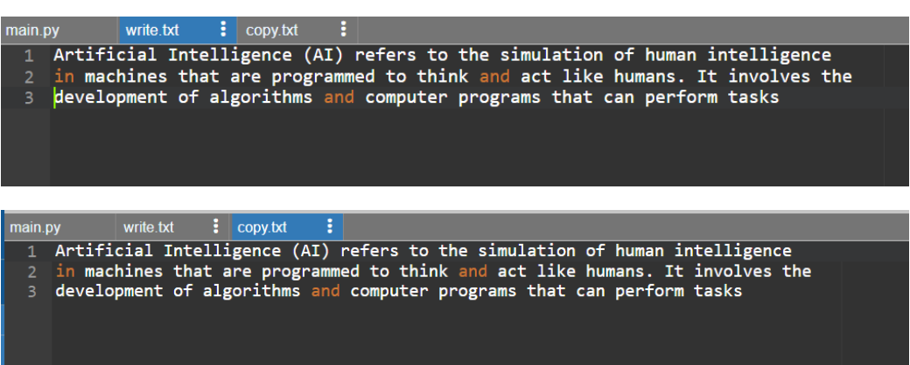

# Copy-File
## AIM:
To write a python program for copying the contents from one file to another file.
## EQUIPEMENT'S REQUIRED: 
PC
Anaconda - Python 3.7
## ALGORITHM: 
### Step 1:
Create a text file with some content in it.
### Step 2: 
 Open the created text file.
### Step 3: 
Create another empty text file.
### Step 4:  
Copy the content of text file to empty file using write function.

## PROGRAM:
```
Program to copy file
Developed by: viswanadham venkata sai sruthi
Register number : 212223100061
with open("write.txt",'r') as file1:
    msg=file1.read()
with open("copy.txt",'w') as file2:
    file2.write(msg)
```
### OUTPUT:





## RESULT:
Thus the program is written to copy the contents from one file to another file.
